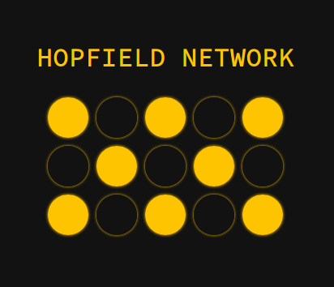

# Hopfield Network Simulation

Interact with a live Hopfield network, a type of neural network that models associative memory.

[View Live](https://mimmackk.github.io/hopfield/simulation/index.html)

